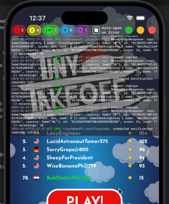

# bevy_debug_log

[](https://bevyengine.org/learn/quick-start/plugin-development/#main-branch-tracking)
[](https://crates.io/crates/bevy_debug_log)
[](https://docs.rs/bevy_debug_log)
[![discord][sh_discord]][lk_discord]

[sh_discord]: https://img.shields.io/discord/1176858176897953872?label=discord&color=5561E6
[lk_discord]: https://discord.gg/rQNeEnMhus

Allows viewing the tracing debug log output inside the app - particularly on platforms like mobile where you have no easy way to follow the terminal output. Beware that currently using this crate will enable `bevy/default_font`. Consider only enabling it in debug builds.



## Usage

```rust
App::new().add_plugins((
    DefaultPlugins.set(LogPlugin {
        filter: "info".into(),
        level: bevy::log::Level::INFO,
        // provide custom log layer to receive logging events
        custom_layer: bevy_debug_log::log_capture_layer,
    }),
    // register our plugin
    bevy_debug_log::LogViewerPlugin::default(),
));


// in any bevy system use this trigger to toggle the debug log ui on and off
commands.trigger(LogViewerVisibility::Toggle);
```

> [!TIP]
> Run `cargo run --example simple` to see this example for yourself!

## Contributing

[See our CONTRIBUTING.md](/CONTRIBUTING.md)

## Our Other Crates

- [bevy_device_lang](https://github.com/rustunit/bevy_device_lang)
- [bevy_web_popups](https://github.com/rustunit/bevy_web_popups)
- [bevy_libgdx_atlas](https://github.com/rustunit/bevy_libgdx_atlas)
- [bevy_ios_iap](https://github.com/rustunit/bevy_ios_iap)
- [bevy_ios_review](https://github.com/rustunit/bevy_ios_review)
- [bevy_ios_gamecenter](https://github.com/rustunit/bevy_ios_gamecenter)
- [bevy_ios_alerts](https://github.com/rustunit/bevy_ios_alerts)
- [bevy_ios_notifications](https://github.com/rustunit/bevy_ios_notifications)
- [bevy_ios_impact](https://github.com/rustunit/bevy_ios_impact)
- [bevy_ios_safearea](https://github.com/rustunit/bevy_ios_safearea)

## Compatible Bevy Versions

|bevy|crate|
|-|-|
|0.17|0.7, main|
|0.16|0.6|
|0.15|0.4, 0.5|
|0.14|0.1, 0.2, 0.3|

## License

bevy_debug_log is dual-licensed under either [MIT](https://opensource.org/license/MIT) or [Apache 2.0](https://www.apache.org/licenses/LICENSE-2.0), at your option.
